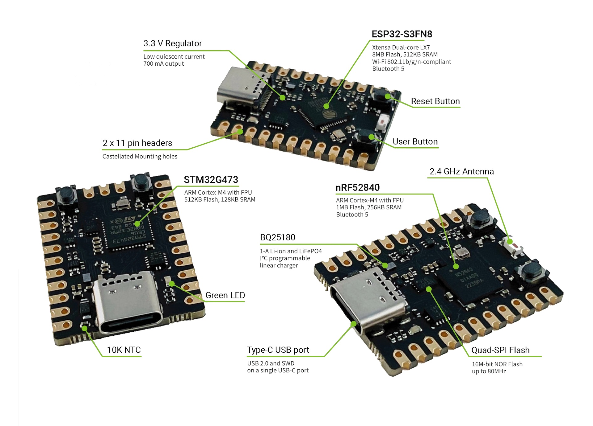

# MADI


SDK for MADI development boards produced by [libmcu](https://libmcu.org).



MADI is a development board based on various microcontroller chips with the
same form factor of 21.59mm x 30mm. The board documentation can be found
[here](https://docs.libmcu.org/boards/libmcu.html) and purchase can be made
[here](https://libmcu.org/kr/madi).

## Getting Started
Please refer to [Quickstart guide](https://docs.libmcu.org/quickstart/).

## Project Layout

```shell
.
├── external
│   ├── cbor
│   ├── libmcu
│   └── tinyusb
├── include
├── ports
│   ├── esp-idf
│   ├── freertos
│   ├── nrf52
│   ├── stm32
│   └── zephyr
├── projects
├── src
└── tests
```

| Directory | Description                                                   |
| --------- | -----------                                                   |
| external  | External dependencies including all the third party libraries |
| include   | Public headers                                                |
| ports     | Adapter codes for a specific hardware or platform             |
| projects  | Build rules                                                   |
| src       | The application-specific code, including private headers      |
| tests     | Automated tests                                               |
| tools     | Tools and utilities                                           |

## Contributing
Contributions are welcome. Feel free to submit issues, enhancement requests and
Pull Request.
